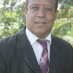

# Nuestros Pastores

### Ángel Cardoza 

Nació en la ciudad de Santo Domingo, en el año 1986. Creció asistiendo a la iglesia y desde muy temprana edad creyó en el Señor Jesucristo y tuvo el deseo de dedicarse exclusivamente en la obra del Señor. En el año 2002-2003 realizó un año de estudios bíblicos en el Instituto Palabra de Vida, en el Estado de Nueva York.

A su regreso sirvió como líder juvenil y maestro en la Iglesia Cristiana de la Comunidad. En el año 2010 obtuvo su título  de Administración de Empresas de la Universidad Católica Santo Domingo y en ese mismo año contrajo matrimonio con Yamel Romero.

En diciembre de 2011 nació su primera hija, Noa Yamel y en Julio de 2012, los tres partieron a la ciudad de Los Ángeles, dónde Ángel estudió por 4 años para obtener su Maestría en Divinidad del Seminario Master’s. Allí formó parte de la Iglesia Grace Community Church,  donde se involucró en la enseñanza en un estudio bíblico hogareño y en la escuela dominical de adultos. En el año 2013,  Dios los bendijo con la llegada de su hija Abi y en el año 2015,  con una hija más: Ana.

A mediados del año 2016, Ángel regresó de Estados Unidos para integrarse a tiempo completo en las labores ministeriales de la iglesia Cristiana de la Comunidad.

### Parménides Vidal

Nació en San Juan de la Maguana,  a finales de la década del 60. Sus padres: Lic. Miguel Ángel Vidal y la Prof. Elena Montero Roa.

En octubre de 1996 contrae matrimonio con Arlina Inés Luciano, con quien procrea dos hijos: Arlette y Ronny Miguel Vidal Luciano.

Siendo apenas un pre-adolescente recibió al Señor Jesucristo como su salvador, en la iglesia Asamblea de Dios de Vallejuelo, municipio de San Juan de la Maguana.

Su liderazgo se inicia en la Iglesia Evangélica Menonita “Buenas Nuevas” de San Juan, en esta congregación fue líder del grupo de jovencitos y jóvenes.

A principio de los años 90 se traslada a Santo Domingo y a su llegada asiste a Iglesia Evangélica Menonita “Príncipe de Paz”, sin embargo, poco tiempo después decide hacerse miembro de la Iglesia Evangélica Menonita Lirio de los Valles, (hoy Iglesia Cristiana de la Comunidad).

En la actualidad,  Parménides Vidal es Co-pastor de la Iglesia Cristiana de la Comunidad y coordinador del trabajo de los diáconos.

Es un expositor pleno de la Palabra de Dios por medio de los Estudios Bíblicos y el mensaje en los cultos. El hermano Parménides es licenciado en Derecho y en Teología y posee el título de Maestría en Teología y Consejería Familiar.

### Lorenzo Mota King

Nació en la provincia de Samaná,  República Dominicana,  en agosto de 1955,  siendo sus padres: Santos Mota Bock y Regina King de Mota.

El 24 de Julio de 1994 contrae matrimonio con Estela Peña de Mota, en ceremonia celebrada en la Iglesia Menonita Lirio de los Valles, oficiada por el Pastor Cristóbal Cardoza.

Desarrolló su niñez bajo la guianza de la palabra de Dios y  siendo apenas un adolescente recibió al Señor Jesucristo como su salvador personal, en la iglesia  Metodista Libre de Sabana de la Mar, y justo cuando había cumplido 15 años de edad  fue bautizado. Inició  su liderazgo en  la misma Iglesia, trabajando con jóvenes e involucrándose en la predicación de la Palabra, viajando a pueblos cercanos como Las Cañitas,  Magua y El Valle de Sabana de la Mar; posteriormente se trasladó al  municipio de Haina,  donde se incorporó al trabajo de la Sociedad de Jóvenes de la Iglesia de Dios, participando en la Directiva local de los Jóvenes, así como el liderato Nacional, llegando a ser Director del Distrito Sur de la Juventud de la Iglesia de Dios.

Durante todo ese tiempo formó parte de diferentes organizaciones, como la Agrupación Músico Vocal Mensajeros de Cristo y la Agrupación Musical Nosotros y Él.

Luego fortaleció su vínculos con el Pastor Cristóbal Cardoza, con quien comenzó a trabajar y apoyarlo en su ministerio pastoral en la Iglesia  Menonita Lirio de los Valles, hoy  Iglesia Cristiana de la Comunidad, donde ha servido en diferentes posiciones en el liderazgo de dicha congregación, llegando a ser, diácono, Anciano, coordinador del Comité de Evangelismo, etc.

En la actualidad,  Lorenzo Mota King forma parte del equipo pastoral de la Iglesia Cristiana de la Comunidad, labor que desempeña en coordinación con los demás miembros del equipo de pastores

Es un expositor pleno de la Palabra de Dios por medio de los estudios bíblicos y el mensaje en los cultos.

En el area profesional, el hermano Lorenzo Mota King,  es licenciado en contabilidad, especializado en Auditoría Externa y Lic. en Teología, mención Consejería Familiar.
En el plano laboral, entre otras cosas, se desempeña como Director Ejecutivo del Servicio Social de Iglesias Dominicanas.

# Que Creemos

Creemos que Dios creó todas las cosas, pero el hombre se ha rebelado contra Dios. Dios nos ama y envía a su hijo, Jesucristo, a vivir una vida perfecta en nuestro lugar, murió por nuestros pecados y resucitó de entre los muertos tres días después.

Todos los que se arrepientan y creen en Jesús recibirán la vida eterna. La iglesia de Dios existe para hacer discípulos de Cristo, predicando su evangelio hasta que Jesús regrese para juzgar al mundo.

Todas estas cosas están escritas en las escrituras perfectas de Dios, la Biblia. Para obtener más detalles sobre lo que creemos, [lea nuestra declaración de fe](assets/declaracion_de_fe.pdf).
