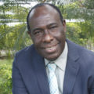
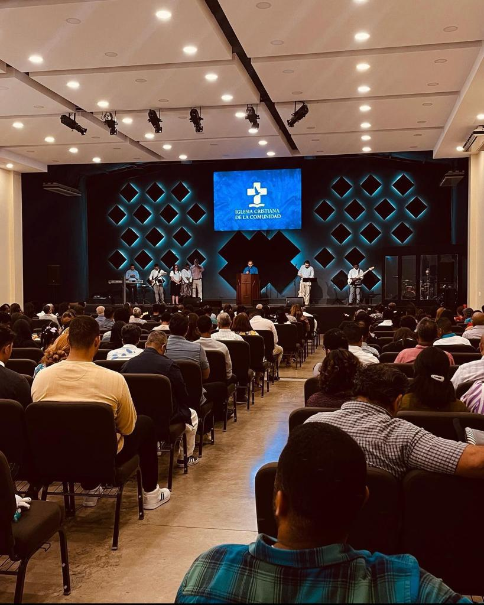

# Nuestros Pastores

### Angel C. Cardoza – Pastor Titular

El Ps. Angel Cardoza se desempeña como Pastor titular de la ICC. Como tal, vela por la misión, visión y enseñanza principal en nuestra congregación.

Es administrador de empresas de profesión y obtuvo una maestría en divinidad del Master’s Seminary. Desde el 2017 ha servido impartiendo algunas clases en el Seminario Teológico Bautista Dominicano y ha sido invitado a enseñar sirviendo a varias instituciones fuera y dentro de nuestro país.

Está casado con Yamel Romero y juntos tienen 5 hijos: Noa, Abi, Ana, Manuel y Mateo

### Lorenzo Mota King – Pastor Asociado

Nació en la provincia de Samaná. Desarrolló su niñez bajo la guía de la palabra de Dios y siendo apenas un adolescente recibió al Señor Jesucristo como su salvador personal.

En el área profesional, es Licenciado en Contabilidad, especializado en Auditoría Externa y Licenciado en Teología, mención Consejería Familiar. En el plano laboral, entre otras cosas, se desempeña como Director Ejecutivo del Servicio Social de Iglesias Dominicanas.

Coordina el trabajo con los diáconos y los trabajo con el ministerio de evangelismo y misiones de nuestra congregación.

Está casado con Estela Peña.

# Iglesia

